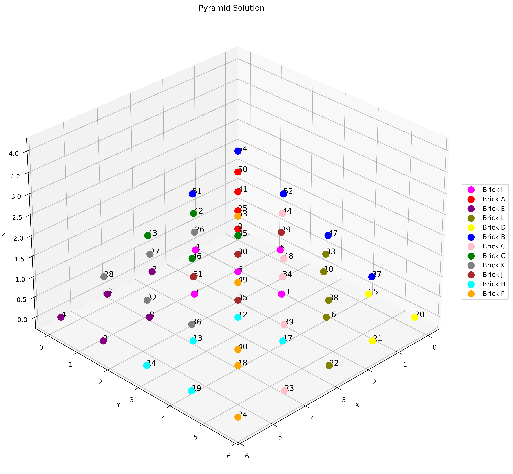

# LongPos Project
A Python project that uses mathematical modeling and algorithms to solve complex 3D puzzles. The core implementation combines:

- Mathematical modeling of 3D geometric structures
- Algorithmic optimization using Dancing Links
- Computational geometry for position calculations
- Matrix operations for spatial transformations

*Example of a 3D puzzle solution visualization*
## Project Structure

Writing order:
* pyrimid_def - Define pyramid shapes and components
* brick_def - Define basic brick structures
* brick_possible_pos - Calculate possible positions for bricks
* process_pos_pkl - Process and save position data
* dancing_links - Implement Dancing Links algorithm
* plot_solution - Visualize 2D solutions
* solution_3d - Generate and visualize 3D solutions

## Features

- 3D puzzle piece definition and manipulation
- Efficient position calculation using Dancing Links algorithm
- Both 2D and 3D solution visualization
- Position data caching using pickle files
- Support for various puzzle shapes including pyramids

## Dependencies

- NumPy: For numerical computations
- Matplotlib: For 2D plotting
- PyVista: For 3D visualization
- Pickle: For data serialization

## Usage

1. Define puzzle pieces using `brick_def.py`
2. Calculate possible positions with `brick_possible_pos.py`
3. Solve using Dancing Links algorithm
4. Visualize results in 2D or 3D

## Solution Visualization

### 2D Solutions
Uses Matplotlib to show layer-by-layer representations of the solution.

### 3D Solutions
Utilizes PyVista to create interactive 3D visualizations with:
- Color-coded puzzle pieces
- Rotation and zoom capabilities
- Cross-section views
- Solution animation support

## Examples

Check the `examples` directory for sample puzzles and their solutions.
